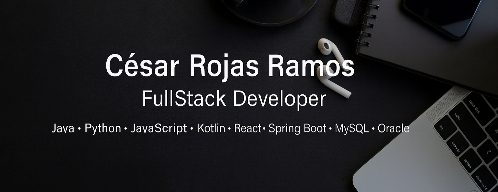

🎓 Estudiante de Ingeniería en Duoc UC (Maipú) | 🚀 Desarrollador FullStack | 💡 Innovador en proyectos tecnológicos y sociales  

Soy un apasionado por el **desarrollo de software, la gestión de bases de datos y la innovación aplicada**. Lidero el **Track FullStack en el CITT** y participo activamente en proyectos de impacto académico, empresarial y social.  
Me motiva crear soluciones escalables con tecnologías modernas y compartir conocimiento con mi comunidad.  

---

## 🚀 Proyectos Destacados

- **🩺 CardioSense – Proyecto Ganador 1er Lugar Hackathon IA Aplicada 2025 (Duoc UC)**  
  Plataforma inteligente para **detección temprana de riesgos cardiacos** mediante:
  - Análisis de señales biomédicas (ECG)  
  - Modelos de *machine learning* (RandomForest + redes neuronales)  
  - Interpretación asistida por IA para estudiantes y profesionales de la salud  
  - Backend en **FastAPI**, dashboards analíticos en Python y base de datos PostgreSQL  
  Este proyecto obtuvo el **primer lugar** gracias a su enfoque social, escalabilidad y potencial real de impacto en salud pública.

- **Descansos del Recuerdo SPA** → Ecosistema completo con **app móvil en Kotlin**, frontend en **React+Vite** y **microservicios con Spring Boot** (API Gateway, JWT, roles).  

- **BloomWatch – NASA Space Apps 2025** → Detección de floración 🌱 en el Parque Nacional Llanos de Challe (Chile) usando **NDVI + imágenes satelitales**.  

- **MiDiarioAI** → Plataforma de acompañamiento emocional con **IA empática**, diario personal y gamificación.  

- **ReciclaCircular** → Proyecto de reciclaje de **PETG** para impresión 3D de herramientas educativas, junto a PYMES locales.  

---

## 🛠️ Tecnologías y Herramientas

### 🔹 Lenguajes de Programación

### 🔹 Frameworks y Librerías

### 🔹 Bases de Datos

### 🔹 Desarrollo Web

### 🔹 Desarrollo Móvil

### 🔹 Otras Habilidades y Herramientas

---

## 📊 Estadísticas de GitHub

  

  
  
  

---

## 🌍 Redes Sociales & Contacto

  
  
  
  
  
  

---

✨ *“El código no solo resuelve problemas, también abre caminos a nuevas oportunidades.”*
